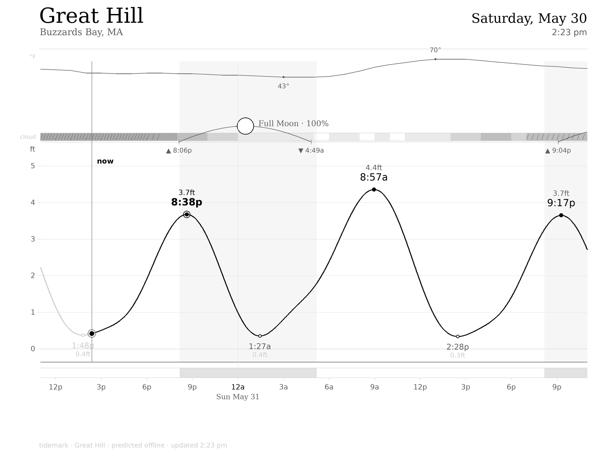

# Tidemark

A clean, offline tide display for e-ink. Tidemark answers one question at a
glance — *when is high tide, and is it during daylight?* — so you can plan the
swim off the dock without checking a tide app.

It runs on a Raspberry Pi driving a Waveshare 7.8" IT8951 e-ink panel, needs no
internet, and is styled in the spirit of Edward Tufte: one black tide line, a
slim day/night band, directly-labeled highs and lows, and a true-phase moon.



## How it works

A small C host runs the display loop and pushes a bitmap to the panel (or to an
SDL simulator on macOS). A Python program generates that bitmap:

```
src/python/
  config.py            Active location: lat/long, timezone, station, units
  data/
    harmonics.py       Harmonic tide engine with full astronomical corrections
    stations.py        NOAA harmonic constituents per station
    tide.py            Tide curve + high/low extrema over a time window
    sun.py             Sunrise/sunset/twilight (NOAA solar algorithm)
    moon.py            Moon phase + rise/set + altitude arc
    weather.py         Optional NWS forecast (temp/cloud/precip), offline-safe
  render/
    theme.py           Palette, fonts, geometry (e-ink friendly)
    ribbon.py          The Tufte-style tide ribbon
  main.py              Assembles data + renders the BMP
src/c/                 Display host (main loop, BMP load, IT8951/SDL backends)
sim/                   SDL2 simulator for desktop iteration
lib/IT8951/            Waveshare driver
```

### Accurate tides, fully offline

Tide height is predicted from NOAA harmonic constituents. The naïve model
`height = MSL + Σ A·cos(speed·t + phase)` is wrong by *hours* because it omits
the equilibrium argument (V₀+u) and nodal factor (f) that real harmonic
prediction needs. `harmonics.py` computes those from the astronomical mean
longitudes, so predictions are accurate with no network connection.

Validated against NOAA station 8447368 (Great Hill):

| metric | result |
|---|---|
| high-tide timing | ~3 min mean error (max 11 min) |
| low-tide timing | flat troughs; heights within ~0.1 m |
| full-curve RMS | ~0.17 m over a ~1.2 m range |
| timing bias | ~0 |

Sun and moon are likewise computed (no hardcoded tables): day length, moon
phase, and moonrise/moonset are correct for any date and location.

## Design

Built for e-ink, where large mid-gray fills and fine texture cause ghosting and
banding. So: white ground, a single black data line, a tiny restrained set of
grays, direct labels, no boxes or heavy gridlines. The chart is rendered at 2×
and downsampled for smooth anti-aliased lines. Daylight high tides sit on white;
night ones sit on a faint gray wash — the swim answer, read at a glance.

The canvas is split into a **sky panel** and a **sea panel** by a horizon line.
The moon traces its real altitude arc across the sky — rising, transiting, and
setting at the correct times and the correct height (a near-solstice full moon
rides low; a winter moon climbs high) — with the phase glyph at its high point.

### Optional weather (the only online piece)

When enabled (`config.WEATHER_ENABLED`), the sky panel also shows an air-
temperature line and a cloud-cover strip (with precip hatching) from the US
National Weather Service. It is strictly additive and offline-safe: the
forecast is cached to disk, refreshed only when stale, and simply omitted when
there is no cache and no network. Tide, sun, and moon never touch the internet.

## Build & run

```bash
# macOS simulator
cd build && make clean && PLATFORM=macos make && ./tidemark_sim

# Raspberry Pi
cd build && make clean && make && sudo ./tidemark

# Generate just the image (any platform with Python 3.9+ and Pillow)
python3 src/python/main.py --output /tmp/tide.bmp
python3 src/python/main.py --now 2026-05-30T14:23 --output /tmp/tide.bmp   # test a time
```

The only Python dependency is **Pillow**. (`make venv` sets up a virtualenv.)

Deploy to a Pi over SSH with `./dev.sh` (rsync + build + run) or `./deploy.sh`
(installs a systemd service).

## Configuring a location

Everything location-specific lives in `src/python/config.py`: name, latitude,
longitude, timezone, units (`ft`/`m`), and which harmonic station to use. Add a
station's NOAA constituents to `src/python/data/stations.py` and point
`config.LOCATION` at it.
