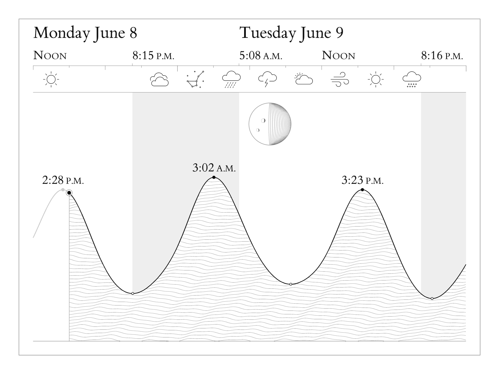

# Tidemark

A clean, offline tide display for e-ink. One black tide line, a day/night band,
directly-labeled highs and lows, and a true-phase moon — the next high tide and
whether it falls in daylight, read at a glance.

It runs on a Raspberry Pi driving a Waveshare 7.8" IT8951 e-ink panel and needs
no internet to render.



## How it works

A small C host runs the display loop and pushes a bitmap to the panel (or to an
SDL simulator on macOS). A Python program generates that bitmap.

Tide height is predicted from NOAA harmonic constituents, computing the
equilibrium argument (V₀+u) and nodal factor (f) that real harmonic prediction
needs — so it stays accurate with no network (validated against NOAA station
8447368: ~3 min mean error on high-tide timing, ~0.17 m full-curve RMS). Sun and
moon are likewise computed from first principles, correct for any date and
location.

```
src/python/   Tide/sun/moon math + Pillow rendering → 8-bit BMP
src/c/        Display host (main loop, refresh strategy, driver layer)
sim/          SDL2 simulator for desktop iteration
lib/IT8951/   Waveshare driver (vendored)
tests/        unittest suite
```

## Build & run

```bash
# macOS simulator
cd build && make clean && PLATFORM=macos make && ./tidemark_sim

# Raspberry Pi
cd build && make clean && make && sudo ./tidemark

# Generate just the image (any platform with Python 3.9+ and Pillow)
python3 src/python/main.py --output /tmp/tide.bmp
python3 src/python/main.py --now 2026-05-30T14:23 --output /tmp/tide.bmp   # test a time
```

The only Python dependency is **Pillow**. Run the tests with
`python3 -m unittest discover -s tests`.

## Configuring a location

Point Tidemark at a NOAA tide station and it fetches everything it needs —
harmonic constituents, coordinates, timezone, and datums — in one command:

```bash
python3 src/python/setup_location.py 8447368            # by NOAA station id
python3 src/python/setup_location.py --near 33.34,-118.33   # nearest station
python3 src/python/setup_location.py 9410079 --name "Avalon" --subtitle "Santa Catalina Island"
```

Find your station id at <https://tidesandcurrents.noaa.gov>. Setup writes
`data/stations/<id>.json` (the harmonic record) and `location.json` (the active
selection). Network is needed only here, at setup; rendering stays fully offline.
Window length, units, and the optional weather row are static knobs in
`config.py`.

### Weather (optional)

With `WEATHER_ENABLED`, a row of line-art weather pictograms
([IBM Carbon](https://carbondesignsystem.com/elements/pictograms/library/),
Apache-2.0) sits between the time axis and the chart, drawn from the US National
Weather Service forecast. Glyphs anchor on noon/midnight and "now", and fill an
in-between cell only when the weather actually changes — sun, cloud, overcast,
rain, snow, wind, thunder, and a constellation for clear nights.

**Outside the US?** NOAA covers the US and its territories. For other coasts,
hand-write a `data/stations/<id>.json` by the same schema using published
harmonic constants — for example the global **TICON-4** dataset (4,383 tide
gauges, CC-BY): <https://doi.org/10.17882/109129>. Then set `station_id` in
`location.json` and fill in your latitude/longitude/timezone.

## Deploy to a Raspberry Pi

```bash
export TIDEMARK_PI=pi@raspberrypi.local     # your Pi's user@host
./deploy.sh                                 # sync, build, install the timer
```

`deploy.sh` syncs the repo, builds on the Pi, installs a systemd timer that
refreshes the panel every 5 minutes, and leaves it on a clean full repaint. The
Pi needs the **bcm2835** library installed (the IT8951 driver links against it);
build it once from <https://www.airspayce.com/mikem/bcm2835/>.

## Troubleshooting

- **`Failed to initialize display` / GPIO errors on the Pi** — the IT8951 driver
  needs root for SPI/GPIO; run via the systemd service (or `sudo`).
- **Garbled or sliver display after deploy** — `deploy.sh` forces a clean
  full-clear baseline; if you ran `./tidemark` manually while the timer was
  live, two processes hit the SPI bus. Stop the timer first (`deploy.sh` does).
- **`tide renderer not found`** — set `TIDEMARK_HOME` to the project root, or
  launch from it (the binary also accepts being run from `build/`).
- **Plain/fallback fonts** — the bundled ET Book lives in `assets/fonts/`; if
  text looks wrong, confirm that directory shipped with the deploy.
